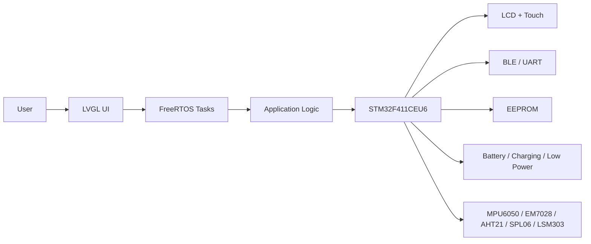
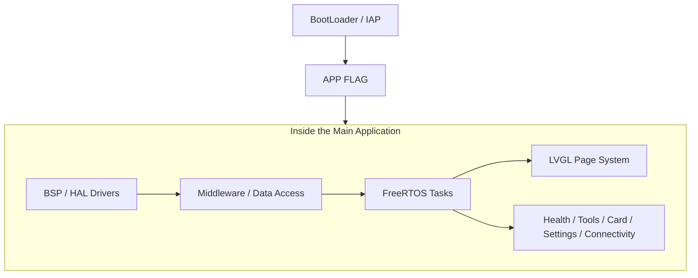
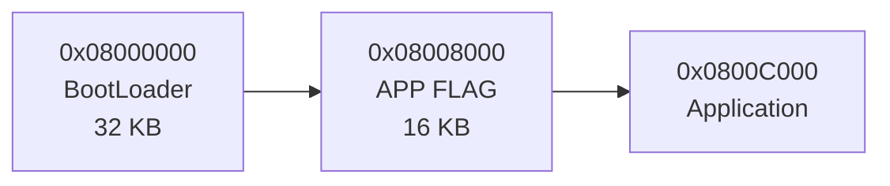

```
 _____     _                 ___  ____
|_   _|_ _| |__   ___   ___ / _ \/ ___|
  | |/ _` | '_ \ / _ \ / _ \ | | \___ \
  | | (_| | | | | (_) |  __/ |_| |___) |
  |_|\__,_|_| |_|\___/ \___|\___/|____/
```

# TahoeOS

> An open-source smartwatch platform based on `STM32F411`, with the full stack in one repo: `BootLoader`, main firmware, hardware design files, enclosure models, and bring-up/debug assets.

## What This Project Is

- This is a real smartwatch project for physical hardware, not only a PC UI demo.
- The core stack is `STM32F411 + FreeRTOS + LVGL`, which makes it useful for embedded GUI and wearable-device development.
- The repository includes `BootLoader + APP + schematics/Gerber + 3D enclosure files`, so it is suitable for coursework, portfolios, prototyping, and firmware experiments.
- The watch firmware already covers the main product paths: UI, sensors, utilities, connectivity, low power, and firmware update flow.

## What It Includes

- UI features: watch face, menu system, multi-page navigation, touch interaction, and icon fonts.
- Health and sensor features: heart-rate page, SpO2 page, pedometer, environment sensing, barometer/altitude, and compass.
- Daily functions: calendar, calculator, stopwatch/timer, card wallet, games, settings, and about page.
- Device capabilities: BLE/UART communication, low-power screen-off/wake flow, external EEPROM storage, and UART IAP upgrade.
- Developer assets: BootLoader project, main application project, LVGL PC simulator, schematics, Gerber outputs, and 3D enclosure files.

## Core Specs

| Module | Solution |
| --- | --- |
| MCU | `STM32F411CEU6` |
| RTOS | `FreeRTOS` |
| GUI | `LVGL v8.2` |
| Display | `1.69-inch LCD + Touch` |
| Sensors | `MPU6050` `EM7028` `AHT21` `SPL06` `LSM303` |
| Storage | External `EEPROM` |
| Update Path | `UART IAP + YMODEM` |

## System Layout

### 1. System View



### 2. Firmware Layers



### 3. Flash Layout



<details>
<summary>Open the original software structure image from the repository</summary>

<p align="center">
  
</p>

</details>

## Repository Map

- [`Software/OV_Watch`](./Software/OV_Watch): main watch firmware, including UI, tasks, drivers, and feature logic.
- [`Software/IAP_F411`](./Software/IAP_F411): BootLoader and IAP project.
- [`Firmware`](./Firmware): exported firmware images.
- [`Hardware`](./Hardware): schematics, Gerber files, and the EDA project.
- [`3D Modle`](./3D%20Modle): `STL` files for the case and buttons.
- [`lv_sim_vscode_win`](./lv_sim_vscode_win): LVGL PC simulator project.
- [`docs`](./docs): bring-up notes and debug reports.
- [`tools`](./tools): host-side helper scripts.

## Where To Start

If this is your first time opening the repo, this path is the fastest way to understand it:

1. Start with the overview sections above to understand what the project is and how the system is organized.
2. For the main watch firmware, open [`Software/OV_Watch`](./Software/OV_Watch).
3. For the update path, open [`Software/IAP_F411`](./Software/IAP_F411).
4. For hardware implementation, open [`Hardware`](./Hardware) and [`3D Modle`](./3D%20Modle).
5. For UI iteration on a PC first, open [`lv_sim_vscode_win`](./lv_sim_vscode_win).

## Development Entry Points

### 1. Flash the Existing Firmware

- BootLoader: [`Firmware/BootLoader_F411.hex`](./Firmware/BootLoader_F411.hex)
- APP: [`Firmware/OV_Watch_V2_4_4.bin`](./Firmware/OV_Watch_V2_4_4.bin)
- App image without bootloader: [`Firmware/OV_Watch_V2_4_4_NoBoot.hex`](./Firmware/OV_Watch_V2_4_4_NoBoot.hex)

### 2. Open the Main Application

- Keil project: [`Software/OV_Watch/MDK-ARM/OV_Watch.uvprojx`](./Software/OV_Watch/MDK-ARM/OV_Watch.uvprojx)
- GCC/CMake project: [`Software/OV_Watch/CMakeLists.txt`](./Software/OV_Watch/CMakeLists.txt)
- Main code structure: `Core + BSP + User`

### 3. Build the BootLoader

```bash
cd Software/IAP_F411
cmake -S . -B build -DCMAKE_TOOLCHAIN_FILE=cmake/arm-none-eabi.cmake
cmake --build build --parallel
```

### 4. Build the Main Application

```bash
cd Software/OV_Watch
cmake -S . -B build -DCMAKE_TOOLCHAIN_FILE=cmake/arm-none-eabi.cmake
cmake --build build --parallel
```

Application flash base is `0x0800C000`, matching the bootloader layout documented above.

### 5. Use the Host-Side Tools

- UART/BLE frame helper: [`tools/ble_proto.py`](./tools/ble_proto.py)
- Local smoke test: [`tools/ble_proto_host_tests.sh`](./tools/ble_proto_host_tests.sh)

## More Docs

- Bring-up guide: [`docs/bringup.md`](./docs/bringup.md)
- Display debug report: [`docs/display-debug-2026-02-06.md`](./docs/display-debug-2026-02-06.md)
